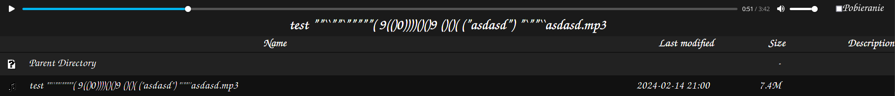

# html-odtwarzacz
# Przeznaczony do używania z serwerem apache
## Styl indeksu plików i skrypt co umożliwia odtwarzanie muzyki w tej samej karcie. Muzyka otwiera się u góry i jest odtwarzacz. 
## Odtwarzacz:

Weź se folder 'index-styl' i daj go do roota serwera apache żeby można było mieć do niego dostęp po prostu wpisując 127.0.0.1/index-styl/ do przeglądarki

Weź se też 'NORMALNY.htaccess' i daj go też do roota tam gdzie folder 'index-styl' jest. Zmień nazwę na '.htaccess'.

No i weź 'MUZYKA.htaccess' i przenieś go do folderu z muzyką, następnie zmień nazwę na '.htaccess'.

No i znaki '' to nie nazwa pliku tylko żeby odróżnić nazwę pliku od np. kropki kończącej zdanie.
